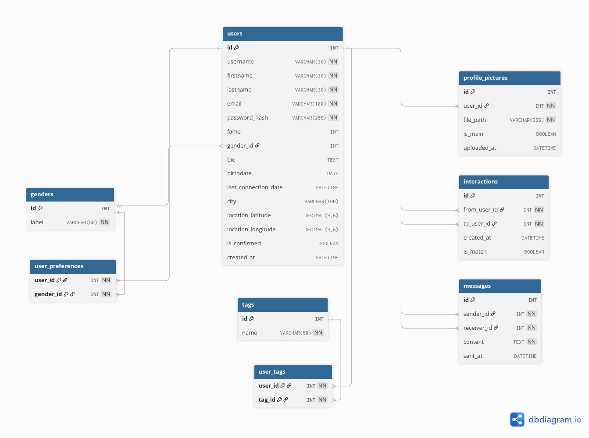

# Project

Matcha is a post-common-core 42 project. The goal of this project is to create a "dating" site.

# Stack
- Front-end : Angular.
- Back-end : Node.js, Express.
- db : MySQL.

# Features
- Profile creation and login security (JWT).
- Searchable, sortable and filtrable list of users.
- User interactions (Liking, unlike, matching, ...).
- Chatting available only to 'Matched' users.
- Instant notifications when receiving a like, match, message or dislike.

# To be implemented
- Blocking system.
- Email verification.
- Profile visited history.
- Audio and video calls for 'Matched' users. (Optional)
- Display users on a map. (Optional)
- Calandar system (To plan events, meetings, date, ...). (Optional)

# Database diagram

# Launching
## With docker
`make`
## Without docker
`make back`

(In anoter terminal) `sudo make front`
